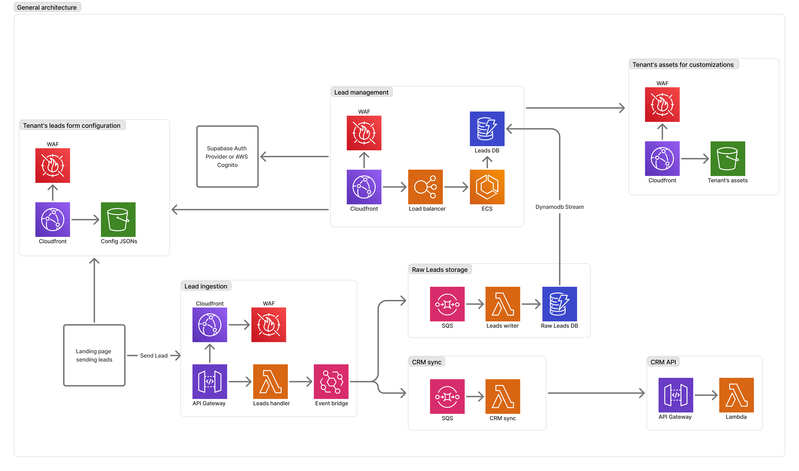

# Lead Management SaaS - MVP Architecture

This architecture diagram represents the infrastructure for a multi-tenant SaaS application focused on lead management. It supports user authentication, lead ingestion from external systems, CRM integration, and customization per tenant.

For this particular solution I'm proposing AWS for cloud computing.

---
## General architecture diagram

## Architecture Overview

### 1. **Lead Ingestion**
- Landing pages send lead data via API Gateway.
- WAF protects the endpoint from malicious traffic.
- Leads are handled by a Lambda function and published to an EventBridge.
- EventBridge triggers:
  - Storage in a raw leads DB.
  - Asynchronous CRM sync.

### 2. **Lead Management**
- UI delivered via CloudFront, protected by WAF.
- A load balancer routes requests to ECS services handling lead CRUD operations.
- Lead data is stored in a managed Leads DB (e.g., DynamoDB).
- DynamoDB Streams allow asynchronous processing.

### 3. **CRM Integration**
- Leads published to an SQS queue are consumed by a CRM Sync Lambda.
- Sync service interacts with external CRM APIs via a secured API Gateway + Lambda combination.

### 4. **Customization per Tenant**
- Tenant branding assets (e.g., logos, themes) and lead form configurations are served from S3 + CloudFront.
- Access is protected with WAF and URL scoping per tenant.
- Custom fields configuration is stored in an S3 bucket so that web pages can fetch the config file and build the form accordingly.

### 5. **Authentication**
- Supports Supabase Auth or AWS Cognito for user management.
- Token-based authentication (JWT) is used across API integrations.

---

## Security Considerations

### UI Security
- **WAF (AWS Web Application Firewall)**:
  - Protects UI endpoints (CloudFront) against common threats (e.g., SQL injection, XSS).
- **Content Security Policy (CSP)**:
  - Enforce strict CSP headers to avoid script injection attacks.
- **Tenant isolation**:
  - Ensure assets are scoped via unique tenant identifiers and signed URLs.

### API Security
- **Authentication**:
  - Use OAuth2/JWTs via Cognito or Supabase Auth.
  - Enforce role-based access control (RBAC) for multi-tenancy.
- **API Gateway**:
  - Rate limiting, IP whitelisting, and throttling.
  - Input validation using API Gateway request models or schema validation in Lambda.
- **EventBridge and SQS**:
  - Use encryption at rest (KMS) and enable message-level IAM permissions.
- **Secrets Management**:
  - Use AWS Secrets Manager for storing API credentials and database connection strings securely.

---

## Recommended Frameworks

### Frontend (UI)
- **React with Next.js**
  - Benefits: SSR/SSG for performance, multi-tenant routing support.
  - Styling: Tailwind CSS for easy theme customization.
  - State: Context API or React Query for managing API data.

### Backend / Implementation
- **API Layer**:
  - **Node.js (Express.js)** for Lambda-based microservices.
  - **TypeScript** for better maintainability and type safety.
- **Event-Driven Services**:
  - **AWS Lambda** with EventBridge and SQS for asynchronous workflows.

### Infrastructure as Code
- **Terraform** or **SST (TypeScript)**
  - Maintain reproducible infrastructure deployments.

### Cloud provider
- AWS

### Database
- **DynamoDB** for high availability, scalability, and integrated stream processing.

---

## Notes

- This MVP is designed for scalability. ECS-based services can later be split into finer-grained microservices or containerized workflows using EKS or Fargate.
- Customization (logos, themes, fields) is decoupled from core logic to simplify scaling and isolate tenant-specific behavior.
